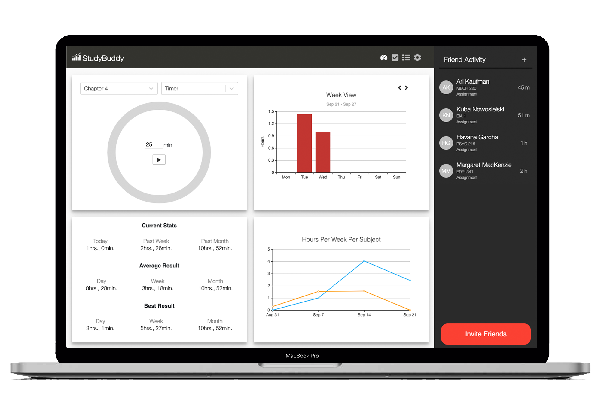
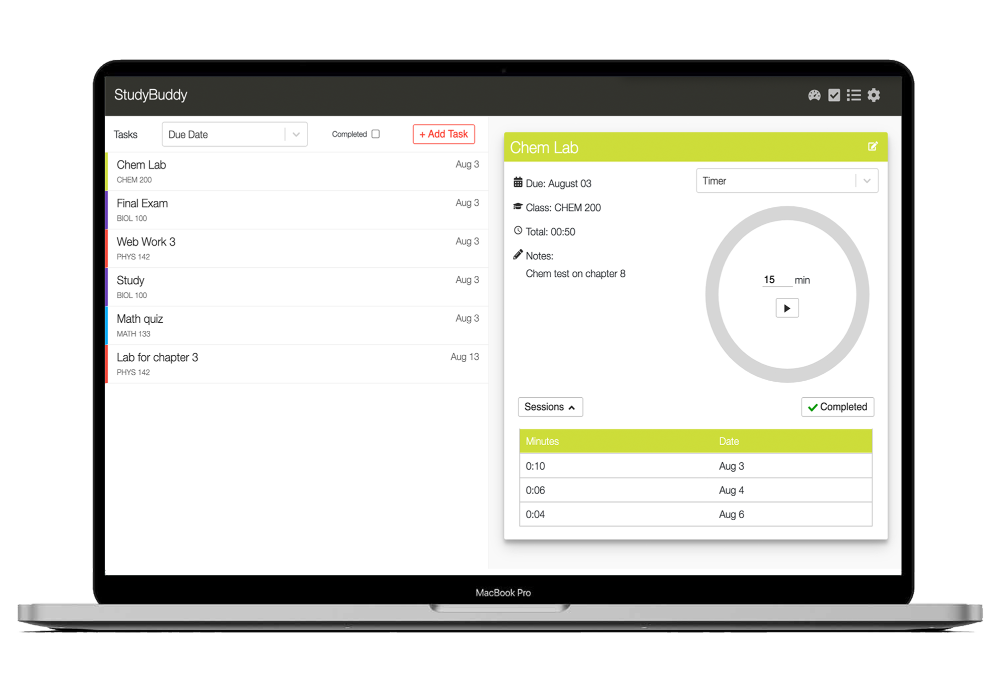
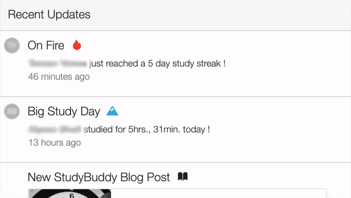
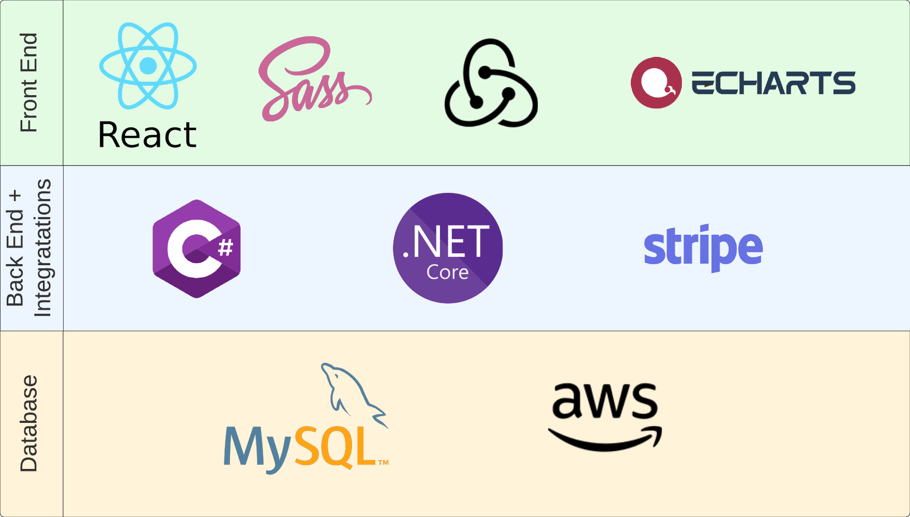
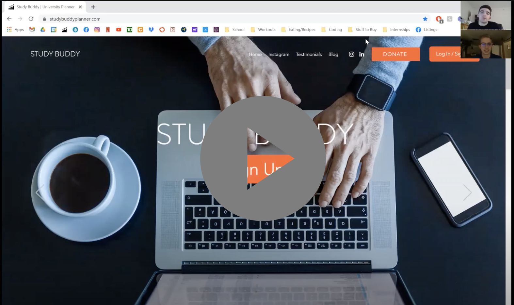

# Table of Contents
[1 Product Gallery](#Product-Gallery)  
[2 Technical Specifics](#Technical-Specifics)  
[2.1 Technical Diagrams](#Technical-Diagrams)  
[2.2 Swagger Screenshots](#Swagger-Screenshots)  
[3 Business Case](#Business-Case)  
[3.1 Video Pitch](#Video-Pitch)  

# Overview

We created a web application that solves two problems for students. Primarily, it allows students to stay connected with their friends while studying from home through online schooling, and secondly, provides a tool that will analyze their study habits to improve their productivity.

Students were forced to study remotely through COVID. With StudyBuddy, we hoped to create a virtual library environment, where students can see when their other friends are actively studying, and the courses that their friends are taking. Moreover, solutions are provided for students to stay on track through the semesters, as it was challenging for most with online school.

# Product Gallery
Below is a gallery of some images and videos of the hosted web application.

The images below shows the dashboard along with the friends tab. The dashboard would provide analytics for all students on their studying, and a mechanism for them to start a study session using the quick timer. The friends tab would display their list of friends on the application, and show when their friends were last studying, or if they are actively studying.

The second image shows the tasks tab. This is where students could create tasks, see the sessions they have worked on each task, and start a time for their specific tasks if they wish. The time spent on their tasks would then be factored into the dashboard analytics shown above.

  | 
 --- | ---

The video below runs through the view one may see when accessing the web application from mobile. The front end (within a seperate repo) was designed to accomodate varying screen sizes. All data is dynamically pulled from the backend using JSON routes.

Finally, below we see the feed. This would allow users to see their study streaks and milestones, along with those of their friends. 

# Technical Specifics
The frontend was made with React.js and Redux. The primary challenges faced on the frontend were local and global state management and creating the components to be as reusable as possible. The state management was broken up into local and global state manageement and using redux-thunk as a middleware to handle api functionallity.

The backend was coded in C#, using DotNetCore. Classes were broken up based on the database structure, whereby each object would correspond to a data table in the mySQL database. Each of these classes would offer a CRUD stack along with listing methods.

The file structure of the API was broken up into 3 layers. The controller layer, the domain layer, and the data access layer. The data access layer would purely be responsible for data retrieival, and would contain the sql statements that would be passed into the database. The domain layer would be the communication point between stacks. For instance, if another stack (for instance the charting service) required information from other data tables, the communication would be done on the domain layer. Finally, the controller layer would surface all routes that would be available to the front end. This layer would also be responsible for all logic surrounding the swagger, and any authorization flags that would be reuqired to call each respective route.

## Technical Diagrams
To better illustrate the technologies used, the following diagrams were created to display the key aspects of the app

### Global State Management
Redux was used to manage the global state management following a structure as shown below

### Tech Stack
The first diagram, shown below, illustrates the entire tech stack of the application. It shows all languages and services used for the implementation, for both the front end (seperate repo), and back end (the current repo).

# Business Case
## Video Pitch
Below, is a video pitch we presented at the QSS Startup Summit. Within this video, all details regarding our business case are thoroughly explained.

Access this pitch recording using the link below:

https://www.youtube.com/watch?v=sSAh3a2N_yQ

Hope you enjoy!

This project was bootstrapped with [Create React App](https://github.com/facebook/create-react-app).

## Available Scripts

In the project directory, you can run:

### `yarn start`

Runs the app in the development mode. 
Open [http://localhost:3000](http://localhost:3000) to view it in the browser.

The page will reload if you make edits. 
You will also see any lint errors in the console.

### `yarn test`

Launches the test runner in the interactive watch mode. 
See the section about [running tests](https://facebook.github.io/create-react-app/docs/running-tests) for more information.

### `yarn build`

Builds the app for production to the `build` folder. 
It correctly bundles React in production mode and optimizes the build for the best performance.

The build is minified and the filenames include the hashes. 
Your app is ready to be deployed!

See the section about [deployment](https://facebook.github.io/create-react-app/docs/deployment) for more information.

### `yarn eject`

**Note: this is a one-way operation. Once you `eject`, you can’t go back!**

If you aren’t satisfied with the build tool and configuration choices, you can `eject` at any time. This command will remove the single build dependency from your project.

Instead, it will copy all the configuration files and the transitive dependencies (webpack, Babel, ESLint, etc) right into your project so you have full control over them. All of the commands except `eject` will still work, but they will point to the copied scripts so you can tweak them. At this point you’re on your own.

You don’t have to ever use `eject`. The curated feature set is suitable for small and middle deployments, and you shouldn’t feel obligated to use this feature. However we understand that this tool wouldn’t be useful if you couldn’t customize it when you are ready for it.

## Learn More

You can learn more in the [Create React App documentation](https://facebook.github.io/create-react-app/docs/getting-started).

To learn React, check out the [React documentation](https://reactjs.org/).

### Code Splitting

This section has moved here: https://facebook.github.io/create-react-app/docs/code-splitting

### Analyzing the Bundle Size

This section has moved here: https://facebook.github.io/create-react-app/docs/analyzing-the-bundle-size

### Making a Progressive Web App

This section has moved here: https://facebook.github.io/create-react-app/docs/making-a-progressive-web-app

### Advanced Configuration

This section has moved here: https://facebook.github.io/create-react-app/docs/advanced-configuration

### Deployment

This section has moved here: https://facebook.github.io/create-react-app/docs/deployment

### `yarn build` fails to minify

This section has moved here: https://facebook.github.io/create-react-app/docs/troubleshooting#npm-run-build-fails-to-minify
